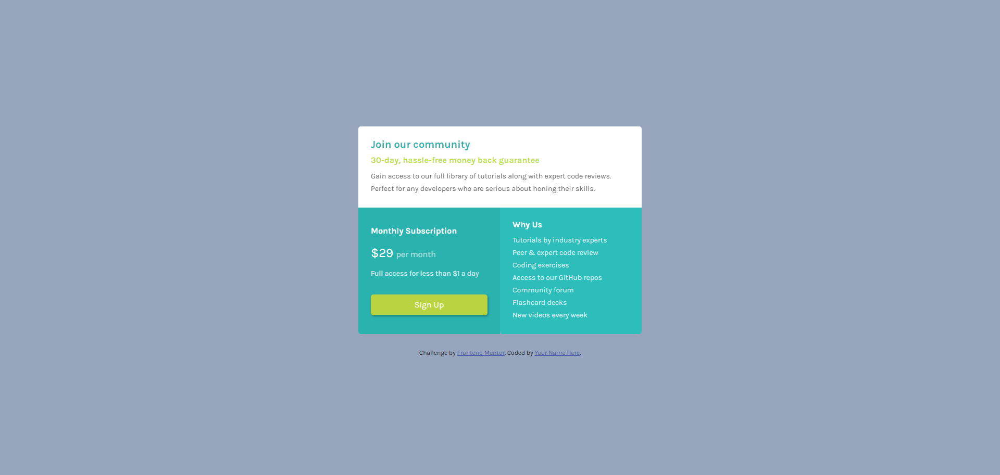

# Frontend Mentor - Single price grid component solution

This is a solution to the [Single price grid component challenge on Frontend Mentor](https://www.frontendmentor.io/challenges/single-price-grid-component-5ce41129d0ff452fec5abbbc). Frontend Mentor challenges help you improve your coding skills by building realistic projects. 

## Table of contents

- [Frontend Mentor - Single price grid component solution](#frontend-mentor---single-price-grid-component-solution)
  - [Table of contents](#table-of-contents)
    - [The challenge](#the-challenge)
    - [Screenshot](#screenshot)
    - [Links](#links)
    - [Built with](#built-with)
    - [What I learned](#what-i-learned)
    - [Continued development](#continued-development)


### The challenge

Users should be able to:

- View the optimal layout for the component depending on their device's screen size
- See a hover state on desktop for the Sign Up call-to-action

### Screenshot




### Links

- Solution URL: https://www.frontendmentor.io/challenges/single-price-grid-component-5ce41129d0ff452fec5abbbc/hub?share=true
- Live Site URL: https://mazz100.github.io/Single-price-grid-component/


### Built with

- Semantic HTML5 markup
- CSS custom properties
- Flexbox
- CSS Grid
- Mobile-first workflow


### What I learned
In this challenge I learned how to mix between both Grid and Flexbox display layout to achieve the final results.

The power of using Flex for the content of cards along the grid display setup with the parent <div> was a fun experience and certainly gives better control and easier UI implementation.
```css
.card1,
.card2,
.card3 {
    padding: var(--masterPadding-padding);

    /* Flex display for cards */
    display: flex;
    justify-content: space-evenly;
    flex-direction: column;
    align-items: start;
}

.container {

        display: grid;
        grid-template-columns: repeat(2, 1fr);
        grid-template-rows: repeat(1, 1fr);
        justify-content: center;
        box-sizing: border-box;
        max-width: var(--masterwidth-Desktop);

    }

```

### Continued development

In my future learning journey I want to have better understanding and implementation of Grid and Flexbox together effectively and get more control and flexibility with using both of them.


